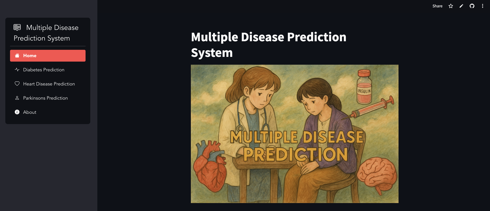
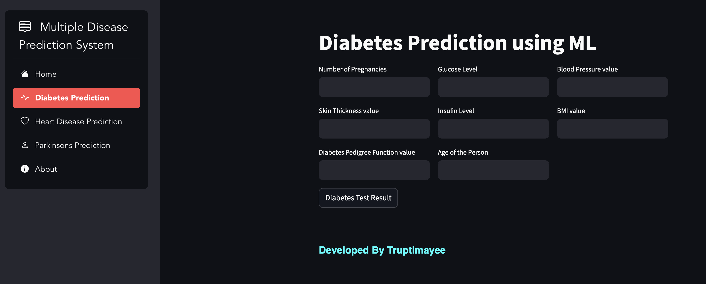
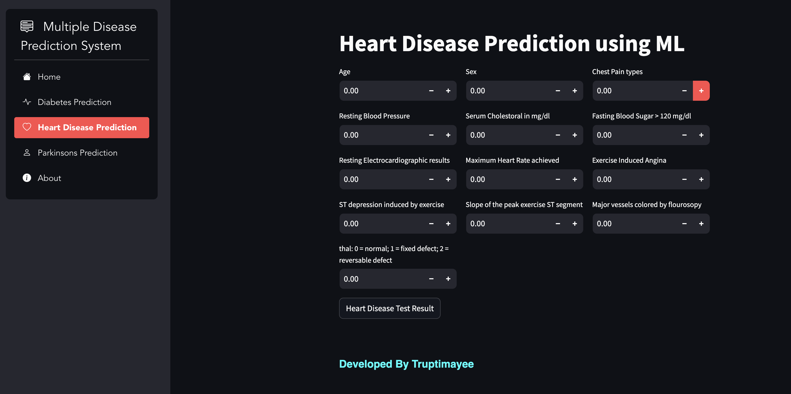
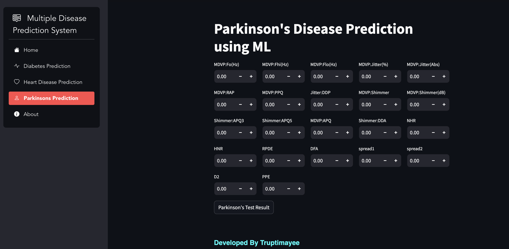
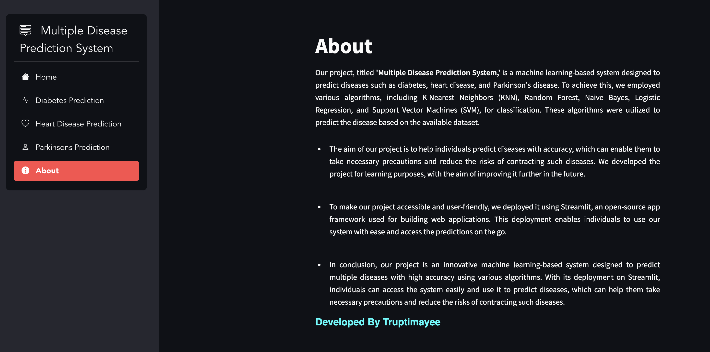

# 🧠 Multiple Disease Prediction System

Welcome to the **Multiple Disease Prediction System** repository! 🚀  
This project is a **machine learning-based web application** that predicts the likelihood of **Diabetes**, **Heart Disease**, and **Parkinson's Disease**.

---

## 🩺 About the Project

The **Multiple Disease Prediction System** is designed to help individuals predict major diseases with accuracy using Machine Learning models.  
It empowers users to take necessary precautions early, thereby reducing health risks.  
This project was developed for learning purposes and will continue to be improved over time! 🌟

---

## 🧬 Diseases Covered

- **Diabetes Mellitus** 🍬  
- **Heart Disease** ❤️  
- **Parkinson's Disease** 🧠

Each disease is briefly explained below to help users understand:

| Disease | Description |
|:--------|:------------|
| **Diabetes** | A chronic condition where the body struggles to regulate blood sugar levels. Regular management is crucial to avoid complications. |
| **Heart Disease** | A group of conditions affecting the heart and blood vessels, leading to life-threatening issues if untreated. |
| **Parkinson's Disease** | A progressive neurological disorder that impacts movement, balance, and coordination. |

---

## 🛠️ Technologies Used

- **Python** 🐍
- **Machine Learning Algorithms** 🤖
  - K-Nearest Neighbors (KNN)
  - Random Forest
  - Naive Bayes
  - Logistic Regression
  - Support Vector Machine (SVM)
- **Streamlit** 🌐 — For building an interactive web application

---

## 📸 Screenshots

Here are some screenshots of the application in action! 🎯

### 🏠 Home Screen

---

### 🍬 Diabetes Prediction Page

---

### ❤️ Heart Disease Prediction Page

---

### 🧠 Parkinson’s Disease Prediction Page

---

### ℹ️ About Page

